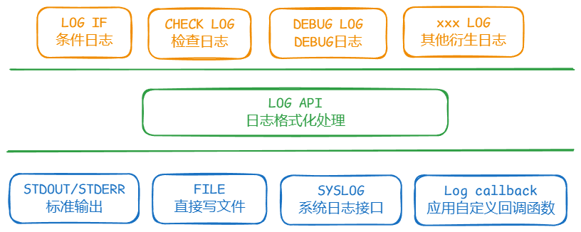
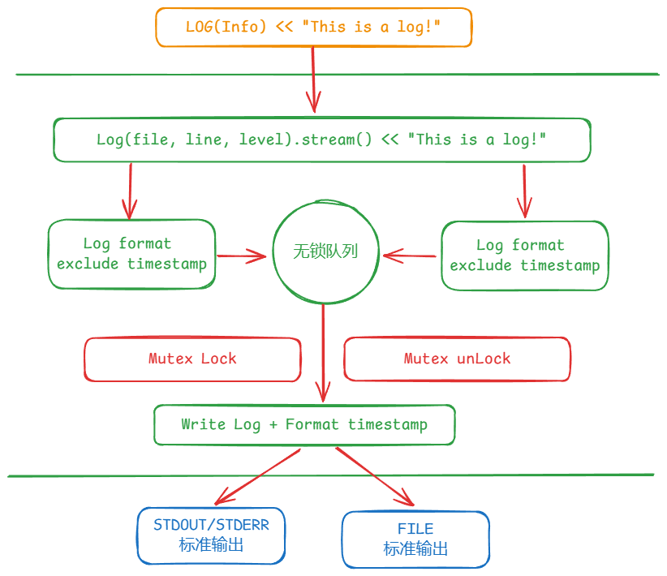
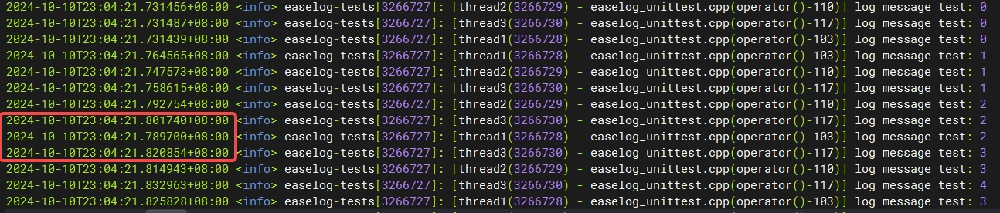
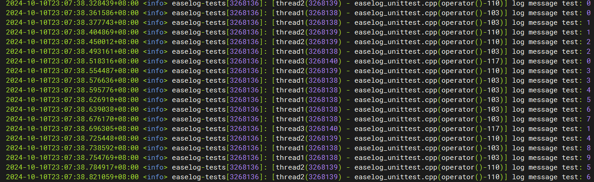

# EaseLog

Author：Once Day	Date：2024年10月8日

**注：本简易日志组件代码实现参考了Google Chrome Log和moduo Log(作者陈硕)源码**。


#### 1. 功能定义

(1) 支持日志级别分类：DEBUG、INFO、WARNING、ERROR，可选支持FATAL。

(2) 输出信息类别：时间戳、进程ID、线程ID、函数名、代码行号和日志信息(支持不定参数)。

(3) 支持多线程：要求时间戳不能乱序，性能方面没有特别要求。

#### 2. 实现分析

一般常见的日志是Debug日志，或者说程序错误日志，典型代表是Linux环境下的`syslog`接口，其满足上述的要求。多线程依靠锁来避免时序问题，性能一般，但拓展性和可读性很好，以文本的形式保存和呈现。

还有一类是写到数据库的日志，具有严格定义的字段和值说明，对性能要求极高，在多线程场景下，需要通过Per-Core数据结构和无锁操作(原子指令)来优化性能，但相应的代码会复杂很多。

这里实现的日志库为普通的程序Debug日志，通过互斥锁来避免并发时序问题。虽然看起来互斥锁在多线程环境下性能一般，但是程序Debug日志是文本类日志，其文本格式化本身需要消耗较大性能，日志量也不可能太大。对于性能敏感型的多线程应用，一般会使用数据库日志来记录相关信息。

在实现上，一般采用分层设计，如下所示：



这里面最核心的部分就是日志格式化处理，一般提供的`API`函数只有一个，然后通过宏包装扩展到各式各样的日志接口。

程序debug日志底层接口基本都支持自定义的回调函数，然后回调函数里再写入到`syslog`中，同时也可以直接输出到标准输出或者标准错误(`STDOUT/STDERR`)。程序很少会自己写日志文件，像`rsyslog`这类标准库更适合拿来就有，毕竟整理和打包大量应用的日志文件，是一件复杂的事情。

`Chrome`和`muduo`里面的日志组件代码，写文件的时候会上锁，其他输出方式则都是无锁。这点很有意思，它们在格式化时间戳时都存在时序问题，也就是时间戳乱序，但开发者似乎并不在意。

`syslog`接口输出的日志时间戳不会乱序(至少`rsyslog`如此)，`syslog`日志文件里面的时间戳并不在程序Log函数中格式化，而是`rsyslogd`进程收集到所有日志消息后统一格式化。

本日志库实现要求中，需要在程序Log函数里格式化时间戳，这意味着在格式化日志时就需要上锁，性能会存在一些影响。这种实现方式比较简单，如下所示:


这个日志组件实现的问题在于锁的粒度太大了，并发线程较多的情况下，debug日志会互相堵塞，拖慢程序执行。一种可行的优化方式是通过多生产者+单消费者的无锁环形队列配合互斥锁实现更小的锁粒度，如下:



通过无锁队列，可以将普通参数信息的格式化剥离出来，但是所有线程仍然会去抢锁写入日志，正常情况是不同线程轮流负责日志写入，串行化写入可以保证时间戳获取点和写入点的顺序一致，从而避免乱序。

想再提高性能，最好的方式是异步日志(上面有一定异步化，但不够彻底)，直接使用单独的日志线程，这个实现起来更加简单，而且无需互斥锁，直接通过无锁队列实现。

本日志组件最终实现两种模式：

- 低并发度下采取上述的互斥锁方法，这样节省线程资源，性能相对也会更好(减少线程切换)。
- 高并发度下采取单独日志线程的方法，优先保证业务的并发处理能力，避免日志堵塞，全局效果更优。

#### 3. 实际测试

目前只实现了基础功能：**低并发度下采取互斥锁**，更上层的复杂日志宏API暂未实现。

测试方面通过创建三个线程来模拟并发日志写入，为了更容易触发乱序，引入随机Sleep操作，在日志格式化和实际写入操作之间，如下所示:

```c++
// 用于构造并发时序, 随机等待 10-50ms
void RandomSleep()
{
    if (g_log_enable_random_sleep) {
        std::this_thread::sleep_for(std::chrono::milliseconds(10 + rand() % 40));
    }
}

// 创建的线程重复20次输出日志
std::thread t1([]() {
    pthread_setname_np(pthread_self(), "thread1");
    for (int i = 0; i < REPEAT_TIMES; i++) {
        LOG(INFO) << "log message test: " << i;
    }
});

// 没有锁保护下的直接日志写入
if (ShouldLogToStderr(severity_)) {
    // 生成时间戳
    std::string timestamp;
    LogSyslogPrefixTimestamp(log_settings, timestamp);
    // 引入随机延迟
    RandomSleep();
    // 写入日志信息
    WriteToFd(STDERR_FILENO, timestamp.data(), timestamp.size());
    WriteToFd(STDERR_FILENO, str_newline.data(), str_newline.size());
}
```

运行后，可以在输出日志里发现明显的乱序情况，如下:



引入互斥锁后，可以避免乱序:

```c++
if (ShouldLogToStderr(severity_)) {
    std::lock_guard< std::mutex > lock(g_log_mutex);
    // 生成时间戳
    std::string timestamp;
    LogSyslogPrefixTimestamp(log_settings, timestamp);
    RandomSleep();
    // 写入日志信息
    WriteToFd(STDERR_FILENO, timestamp.data(), timestamp.size());
    WriteToFd(STDERR_FILENO, str_newline.data(), str_newline.size());
}
```

运行截图如下:



但对性能影响较大，整体运行时间较没有上锁，增加了2倍，因为线程需要互相等待对方sleep结束才能拿到锁。

不过，实际运行的程序很少会出现这么久的锁内延迟时间，这毕竟只是一个测试模拟情况。

下一步准备实现第二种模式：**高并发度下采取单独日志线程**。
